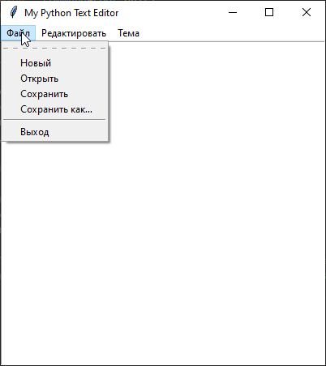
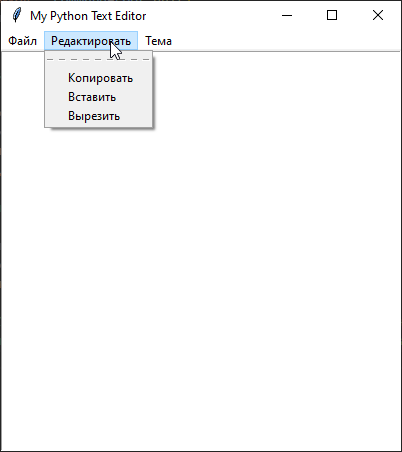
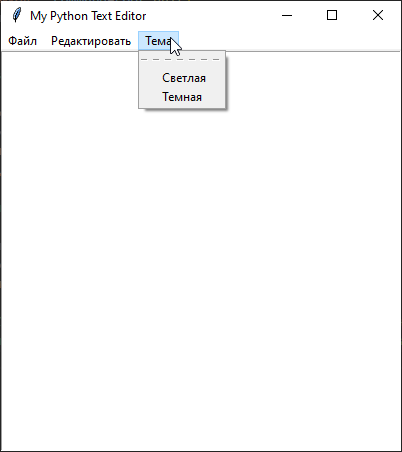
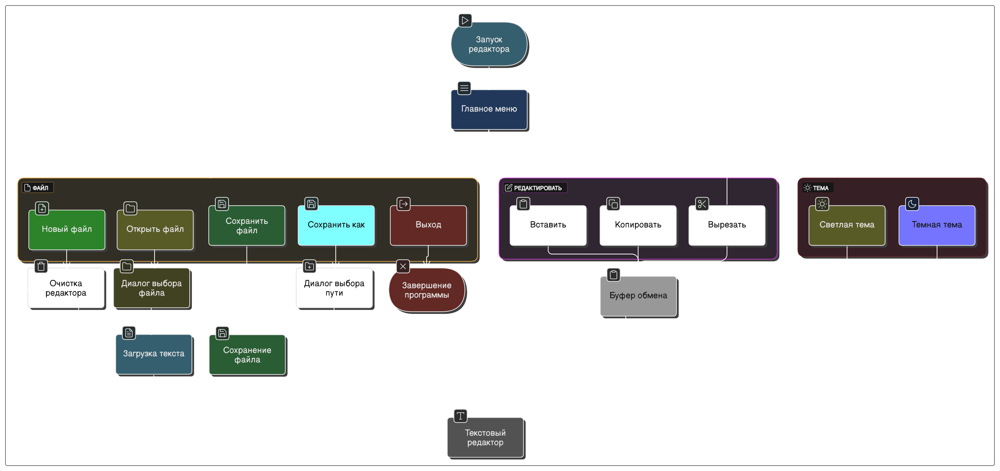

# Создание статического веб-сайта
## 📝Введение

### Цель: 
Разработать функциональный статический веб-сайт с использованием генератора сайтов Hugo, демонстрирующий навыки работы с HTML и CSS.

### Задачи:
1. Освоить базовые приёмы работы с системой контроля версий Git
2. Организовать структуру репозитория проекта на GitHub
3. Изучить синтаксис разметки Markdown для оформления документации
4. Настроить и использовать генератор статических сайтов Hugo
5. Разработать структуру и содержимое сайта: главную страницу, страницы «О проекте», «Участники», «Журнал» и «Ресурсы»
6. Настроить внешний вид сайта
7. Наполнить сайт актуальным контентом и визуальными элементами
---

## Настройка Git и репозитория
### ⚙️ 1. Установка Git
Устанавливаем Git на локальную машину (если ещё не установлен). После  создания репозитория (в нашем случае на Gihub) клонируем его на локальный компьютер:
```bash
git clone https://github.com/имя_пользователя/имя_репозитория.git
cd имя_репозитория
```

### ⚙️ 2. Настройка Git
Настраиваем имя пользователя и email с помощью команд:

```bash
git config --global user.name "Имя"
git config --global user.email "email@example.com"
```

### ⚙️ 3. Базовые команды Git
#### 🔹 Коммит
Мы добавляем файлы или редактируем существующие. Затем сохраняем изменения:
```bash
git commit -m "Сообщение"
```

#### 🔹 Отправка изменений на сервер
Публикуем наши коммиты в удалённый репозиторий:
```bash
git push origin main
```
#### 🔹 Работа с ветками
Создаём новую ветку для работы над задачей:
```bash
git checkout -b feature/название
```
---

### Написание документов в Markdown
Мы изучили основы синтаксиса Markdown и применили их для оформления всей документации проекта. 
Ознакомились с основными правилами Markdown (заголовки, списки, выделение текста, ссылки, код и т.д.)

#### Пример синтаксиса
```markdown
# Заголовок H1
## Заголовок H2

**Жирный текст**, *курсив*, `код`

- Маркированный список
1. Нумерованный список

[Ссылка](https://example.com)
```

### Создание статического веб-сайта
---
# Создание текстового редактора на Python
## 📝Введение

### Цель: 
Разработать функциональный текстовый редактор с графическим интерфейсом на языке программирования Python с использованием библиотеки Tkinter, обеспечивающий базовые возможности работы с текстовыми файлами.

### Задачи:
1. Изучить возможности библиотеки Tkinter для создания графического интерфейса.
2. Реализовать основные функции редактора:
    - создание нового файла
    - открытие и сохранение файлов
    - сохранение с новым именем
3. Реализовать дополнительные функции редакторы (модифицировать проект):
    - смена темы оформления
    - функции "Копировать", "Вставить и "Вырезать"
4. Обеспечить удобный и понятный пользовательский интерфейс.

### Cтек технологий

| **Инструмент / Технология** | **Назначение** |
| --------------------------- | -------------------------------------------------------------------------------------------- |
| **Python 3.x**              | Язык программирования, на котором построена логика текстового редактора                      |
| **Tkinter**                 | Встроенная в Python библиотека для создания графического пользовательского интерфейса (GUI)  |
| **Visual Studio Code**      | Основная среда разработки (IDE), используемая для написания, редактирования и отладки кода   |
| **Markdown**                | Формат для написания технической документации и описания проекта                             |
| **Git**                     | Система контроля версий для отслеживания изменений в коде                                    |
| **GitHub**                  | Платформа для размещения репозитория                                                         |

---

## 📚 Библиотека Tkinter
**Tkinter** — это стандартная библиотека Python для создания графического интерфейса пользователя (GUI), предоставляющая простой и эффективный способ разработки кроссплатформенных настольных приложений. Она входит в стандартную поставку Python и не требует дополнительной установки, что делает её удобным инструментом для быстрого создания GUI-приложений.

Tkinter является обёрткой над библиотекой **Tk**, реализованной на языке C и предназначенной для создания и управления графическими элементами интерфейса. Каждый объект Tk содержит собственный экземпляр интерпретатора Tcl с загруженным Tk, что обеспечивает высокую настраиваемость виджетов, хотя и с устаревшим внешним видом. Tk использует очередь событий Tcl для генерации и обработки событий GUI.

### Основные возможности
- **Создание окон и виджетов**: Tkinter предоставляет разнообразные виджеты, такие как кнопки, метки, текстовые поля, меню и другие, позволяя создавать интерактивные пользовательские интерфейсы. ([GeeksforGeeks][2])
- **Управление размещением элементов**: Существует три способа размещения виджетов: `pack()` — для последовательного размещения, `grid()` — для табличной компоновки и `place()` — для точного позиционирования по координатам.
- **Обработка событий**: Tkinter использует событийно-ориентированную модель, позволяя реагировать на действия пользователя, такие как нажатия кнопок, перемещения мыши и ввод текста.
- **Графика и рисование**: С помощью виджета `Canvas` можно рисовать линии, фигуры, текст и изображения, что полезно для создания визуализаций и простых игр.
- **Меню и диалоговые окна**: Поддерживается создание выпадающих и контекстных меню, а также стандартных диалогов для открытия/сохранения файлов, выбора цвета и отображения сообщений.
- **Поддержка стилей и тем**: Модуль `ttk` предоставляет стилизованные версии стандартных виджетов, приближая внешний вид интерфейса к нативному для операционной системы.
- **Кроссплатформенность**: Приложения, созданные с использованием Tkinter, работают на Windows, macOS и Linux без необходимости изменения кода.


### Tkinter идеально подходит для:
- Образовательных целей (обучение GUI)
- Быстрого создания прототипов интерфейсов
- Небольших настольных приложений
- Программ с простым пользовательским вводом и взаимодействием

---

## 🛠️ Создание текстового редактора на Python (пошаговое руководство)
Для создания текстового редактора был использован следующий обучающий материал:

🔗 Make With Data —  [Python Tutorial: Make Your Own Text Editor](https://www.youtube.com/watch?v=xqDonHEYPgA)

### ⚙️ Шаг 1: Установка Python

Убедимся, что Python установлен:

```bash
python --version
```
---

### ⚙️ Шаг 2: Реализация основных функций редактора

Создадим файл `texteditor.py` и реализуем следующий код:

#### 🔹 Импорт необходимых библиотек

```python
from tkinter import *  # Импорт всех виджетов и функций из tkinter
from tkinter.filedialog import *  # Импорт диалогов открытия и сохранения файлов
from tkinter import messagebox  # Импорт всплывающих окон для сообщений об ошибках
```

> Эти библиотеки позволяют создать интерфейс и реализовать взаимодействие с файлами.

---

#### 🔹 Инициализация глобальных переменных

```python
filename = None  # Имя текущего открытого или сохраняемого файла
```

---

#### 🔹 Операции с файлами

1. Создание нового файла
```python
def newFile():
    global filename
    filename = "Untitled"
    text.delete(0.0, END)  # Очищает всё текстовое поле
```
> Функция очищает текстовое поле и сбрасывает имя текущего файла.

2. Открытие файла
```python
def openFile():
    f = askopenfile(mode='r')  # Открываем диалог выбора файла
    t = f.read()  # Чтение содержимого файла
    text.delete(0.0, END)  # Очищаем текущее содержимое редактора
    text.insert(0.0, t)  # Вставляем прочитанный текст в редактор
```
> Открывает и отображает содержимое выбранного файла.

3. Сохранение файла
```python
def saveFile():
    global filename
    t = text.get(0.0, END)  # Получаем содержимое текстового поля
    f = open(filename, 'w')  # Открываем файл для записи
    f.write(t)  # Записываем текст в файл
    f.close()  # Закрываем файл
```
> Сохраняет текущий текст в файл, имя которого уже задано.


4. Сохранить как...
```python
def saveAs():
    f = asksaveasfile(mode='w', defaultextension='.txt')  # Открываем диалоговое окно "Сохранить как"
    t = text.get(0.0, END)
    try:
        f.write(t.rstrip())  # Удаляем лишние пробелы в конце и записываем текст
    except:
        messagebox.showerror(title="Ошибка", message="Не удалось сохранить файл")  # Обработка ошибки сохранения
```
> Позволяет сохранить файл под новым именем через диалоговое окно.
---


#### 🔹 Инициализация главного окна
```python
root = Tk()
root.title("My Python Text Editor")  # Установка заголовка окна
root.minsize(width=400, height=400)  # Минимальный размер окна
root.maxsize(width=400, height=400)  # Максимальный размер окна
```
> Создаётся главное окно приложения с фиксированными размерами.
---


#### 🔹 Поле для ввода текста
```python
text = Text(root, width=400, height=400)  # Основное текстовое поле
text.pack()  # Размещение на экране
```
> Основная область редактора для работы с текстом.
---

#### 🔹 Создание меню
```python
menubar = Menu(root)
```

#### 🔹 Подменю «Файл»
```python
filemenu = Menu(menubar)
filemenu.add_command(label="Новый", command=newFile)
filemenu.add_command(label="Открыть", command=openFile)
filemenu.add_command(label="Сохранить", command=saveFile)
filemenu.add_command(label="Сохранить как…", command=saveAs)
filemenu.add_separator()
filemenu.add_command(label="Выход", command=root.quit)
menubar.add_cascade(label="Файл", menu=filemenu)
```
> Команды для создания, открытия, сохранения и выхода.
---


#### 🔹 Привязка меню к окну и запуск приложения
```python
root.config(menu=menubar)  # Привязка меню к окну
root.mainloop()  # Запуск главного цикла приложения
```
> Запускается основное окно редактора, которое работает до закрытия пользователем.
---


### ⚙️ Шаг 3: Модификация проекта

#### 🔹 Тема оформления (светлая/тёмная)
Инициализируем новую переменную:
```python
current_theme = "light"  # Тема по умолчанию — светлая
```
> Инициализируем новую переменную для хранения информации о текущей теме оформления (светлая или тёмная).

```python
def setLightTheme():
    global current_theme
    text.config(bg="#2e2e2e", fg="black")  # Настройка цветов для светлой темы
    root.config(bg="white")
    current_theme = "light"
```

```python
def setDarkTheme():
    global current_theme
    text.config(bg="#2e2e2e", fg="white")  # Настройка цветов для тёмной темы
    root.config(bg="#2e2e2e")
    current_theme = "dark"
```
> Функции переключают внешний вид редактора между светлой и тёмной темами.
---

#### 🔹  Операции с буфером обмена
1. Копирование
```python
def copyText():
    text.clipboard_clear()  # Очистить буфер обмена
    text.clipboard_append(text.get(0.0, END))  # Скопировать текст в буфер
```

2. Вставка
```python
def pasteText():
    try:
        clipboard_text = root.clipboard_get()  # Получить текст из буфера
        text.insert(INSERT, clipboard_text)  # Вставить текст в курсорную позицию
    except:
        messagebox.showerror("Ошибка", "Не удается вставить текст")
```

4. Вырезание
```python
def cutText():
    copyText()  # Сначала копировать текст
    text.delete(0.0, END)  # Затем удалить его
```
---


#### 🔹 Подменю «Редактировать»
```python
editmenu = Menu(menubar)
editmenu.add_command(label="Копировать", command=copyText)
editmenu.add_command(label="Вставить", command=pasteText)
editmenu.add_command(label="Вырезать", command=cutText)
menubar.add_cascade(label="Редактировать", menu=editmenu)
```
> Классические команды редактирования.

#### 🔹 Подменю «Тема»
```python
viewmenu = Menu(menubar)
viewmenu.add_command(label="Светлая", command=setLightTheme)
viewmenu.add_command(label="Темная", command=setDarkTheme)
menubar.add_cascade(label="Тема", menu=viewmenu)
```
> Позволяет переключаться между светлой и тёмной темами редактора.
---

## 📄 Полный код текстового редактора на Python
```python
from tkinter import * 
from tkinter.filedialog import * 
from tkinter import messagebox

# Глобальные переменные
filename = None
current_theme = "light"

# Создание нового файла
def newFile():
    global filename
    filename = "Untitled"
    text.delete(0.0, END)

# Сохранение текущего файла
def saveFile():
    global filename
    t = text.get(0.0, END)
    f = open(filename, 'w')
    f.write(t)
    f.close() 

# Сохранить как...
def saveAs():
    f = asksaveasfile(mode='w', defaultextension='.txt')
    t = text.get(0.0, END)
    try:
        f.write(t.rstrip())
    except:
        messagebox.showerror(title="Ошибка", message="Не удалось сохранить файл")

# Открытие файла
def openFile():
    f = askopenfile(mode='r')
    t = f.read()
    text.delete(0.0, END)
    text.insert(0.0, t)

# Светлая тема оформления
def setLightTheme():
    global current_theme
    text.config(bg="#2e2e2e", fg="black")
    root.config(bg="white")
    current_theme = "light"

# Тёмная тема оформления
def setDarkTheme():
    global current_theme
    text.config(bg="#2e2e2e", fg="white")
    root.config(bg="#2e2e2e")
    current_theme = "dark"

# Копирование текста
def copyText():
    text.clipboard_clear()
    text.clipboard_append(text.get(0.0, END))

# Вставка текста
def pasteText():
    try:
        clipboard_text = root.clipboard_get()
        text.insert(INSERT, clipboard_text)
    except:
        messagebox.showerror("Ошибка", "Не удается вставить текст")

# Вырезание текста
def cutText():
    copyText()
    text.delete(0.0, END)

# Инициализация главного окна
root = Tk()
root.title("My Python Text Editor")
root.minsize(width=400, height=400)
root.maxsize(width=400, height=400)

# Текстовое поле
text = Text(root, width=400, height=400)
text.pack()

# Меню
menubar = Menu(root)

# Подменю "Файл"
filemenu = Menu(menubar)
filemenu.add_command(label="Новый", command=newFile)
filemenu.add_command(label="Открыть", command=openFile)
filemenu.add_command(label="Сохранить", command=saveFile) 
filemenu.add_command(label="Сохранить как…", command=saveAs) 
filemenu.add_separator() 
filemenu.add_command(label="Выход", command=root.quit) 
menubar.add_cascade(label="Файл", menu=filemenu)

# Подменю "Редактировать"
editmenu = Menu(menubar)
editmenu.add_command(label="Копировать", command=copyText) 
editmenu.add_command(label="Вставить", command=pasteText)
editmenu.add_command(label="Вырезать", command=cutText)
menubar.add_cascade(label="Редактировать", menu=editmenu)

# Подменю "Тема"
viewmenu = Menu(menubar)
viewmenu.add_command(label="Светлая", command=setLightTheme)
viewmenu.add_command(label="Темная", command=setDarkTheme)
menubar.add_cascade(label="Тема", menu=viewmenu)

# Применение меню
root.config(menu=menubar)
root.mainloop()
```
---

## 🖼️ Скриншоты интерфейса редактора

|  |  |  |
|-----------------------------|-----------------------------|-----------------------------|
| Подменю «Файл»              | Подменю «Редактивровать»    | Подменю «Тема»              |


## 🧩 Функциональная блок-схема редактора


---

## ✅ Заключение

В результате проекта был создан функциональный текстовый редактор на Python с использованием библиотеки Tkinter. Реализованы как базовые возможности (создание, открытие и сохранение файлов), так и дополнительные функции (работа с буфером обмена, а также переключение между светлой и тёмной темами оформления). Работа над проектом позволила закрепить навыки использования библиотеки Tkinter и реализовать простой, но наглядный пример GUI-приложения.

